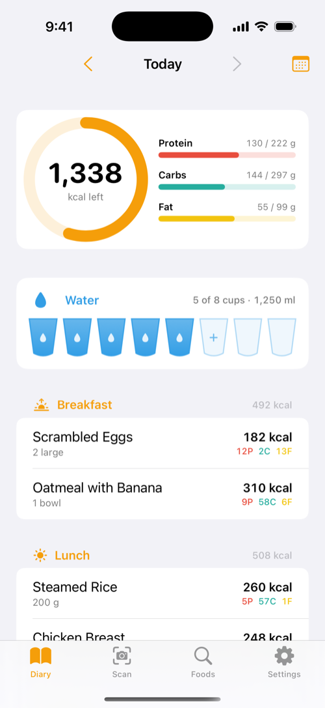
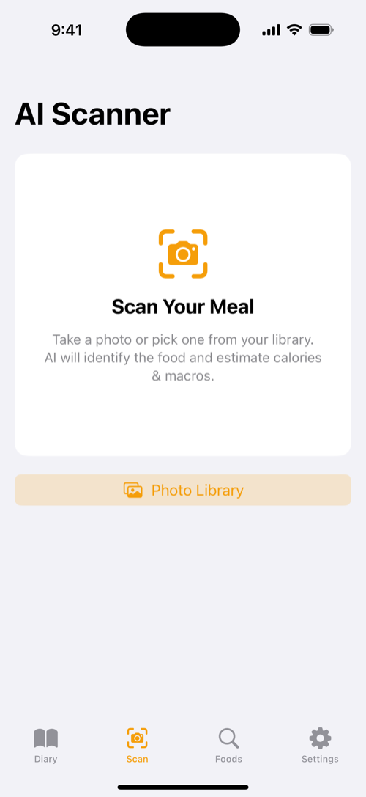
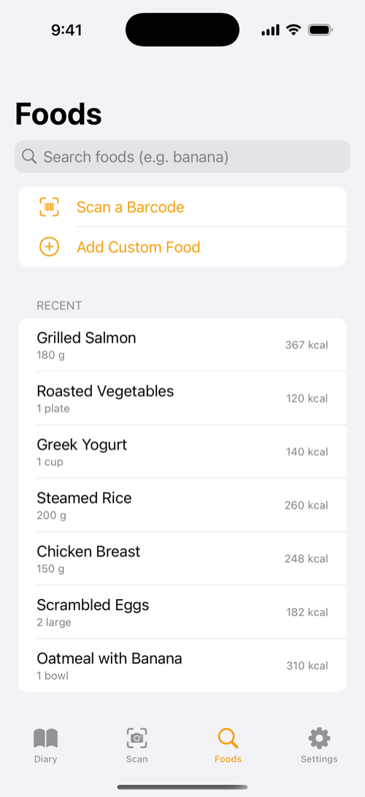
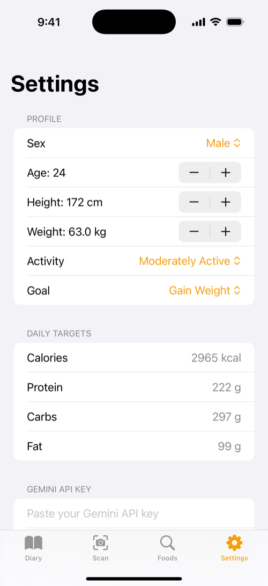

# 🍽️ Igain

**AI-powered food diary for iOS — snap a meal, scan a barcode, track your macros and water.**


A Cronometer-inspired calorie & macro tracker built entirely with SwiftUI. Log food by photographing your plate (Gemini AI estimates the nutrition), scanning a product barcode, searching OpenFoodFacts, or entering it manually — then watch your daily calories, protein, carbs, fat, and water fill up on the dashboard.

---

## 📷 Screenshots

| Diary | AI Scanner | Foods | Settings |
|:---:|:---:|:---:|:---:|
|  |  |  |  |

---

## ✨ Features

- 📸 **AI Meal Scanner** — take a photo of your meal and Gemini 2.5 Flash identifies each food item and estimates calories & macros; review and edit before logging
- 🏷️ **Barcode Scanner** — live barcode scanning with VisionKit, nutrition pulled from the OpenFoodFacts database (manual code entry fallback in the simulator)
- 🔍 **Food Search** — search millions of products on OpenFoodFacts with serving-size slider and per-meal logging
- 📖 **Daily Diary** — Cronometer-style dashboard with a calorie ring, macro progress bars, and meals grouped into Breakfast / Lunch / Dinner / Snacks
- ✏️ **Tap to Edit** — tap any logged food to reveal pencil (edit) and trash (delete) actions; every field is editable after logging
- 💧 **Water Tracker** — 8 tappable water cups on the dashboard (250 ml each), tracked per day
- 📅 **Calendar History** — jump to any past day and review its macro totals at a glance
- 🔁 **Quick Re-log** — one-tap re-logging of recent foods
- 🎯 **Personalized Targets** — onboarding calculates calorie/macro targets (Mifflin-St Jeor) from your stats and goal
- 🔐 **Private by design** — all data stays on device in SwiftData; the Gemini API key lives in the iOS Keychain

## 🛠️ Tech Stack

| Layer | Technology |
|---|---|
| Language | Swift 5.10 |
| UI | SwiftUI (iOS 17+, Observation framework) |
| Persistence | SwiftData |
| AI | Google Gemini 2.5 Flash (vision + JSON output) |
| Food database | [OpenFoodFacts REST API](https://world.openfoodfacts.org) |
| Barcode scanning | VisionKit `DataScannerViewController` |
| Camera | UIKit `UIImagePickerController` via `UIViewControllerRepresentable` |
| Secrets | Security framework (Keychain) |
| IDE / Build | Xcode 16, XCTest |

## 📁 Project Structure

```
Igain/
├── Models/          # SwiftData models: FoodEntry, UserProfile, WaterDay, MealType
├── ViewModels/      # Observable view models (scanner, food search)
├── Services/        # GeminiService, OpenFoodFactsService, NutritionCalculator, KeychainHelper
├── Theme/           # Cronometer-inspired color palette & card styling
└── Views/
    ├── Diary/       # Dashboard: calorie ring, macro bars, water cups, calendar history
    ├── Scanner/     # AI meal scanner: camera, photo picker, results sheet
    ├── Foods/       # Search, barcode scanner, manual entry, food detail
    ├── Onboarding/  # Profile setup & target calculation
    └── Settings/    # Gemini API key, profile & targets
```

## 🚀 Getting Started

1. **Clone**
   ```bash
   git clone https://github.com/NeilAlvn/igain.git
   cd igain && open Igain.xcodeproj
   ```
2. **Run** — select your device or simulator in Xcode and hit ⌘R.
   The camera and barcode scanner need a **physical iPhone**; the simulator falls back to photo library and manual barcode entry.
3. **Enable the AI scanner** — grab a free API key at [aistudio.google.com](https://aistudio.google.com) → *Get API key*, then paste it in **Settings → Gemini API Key** inside the app. It's stored in the Keychain, never in the repo.

## 📱 Requirements

- iOS 17.0+
- Xcode 16+
- A Gemini API key (free tier works) for the AI meal scanner — everything else works without it

## 👥 Authors

**Neil Alvin Medallon** — [@NeilAlvn](https://github.com/NeilAlvn)
**Vince Daniel Tamis**

---

Built with ❤️ and SwiftUI. 🤖 Developed with [Claude Code](https://claude.com/claude-code).
